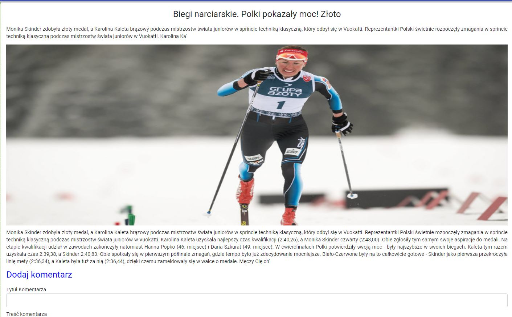

# BlogFront

## Descryption

Application allows users to create and read blogs

## Functionalities

<ul>
<li>
Authentication
  <ul>
    <li>Login</li>
    <li>Registration</li>
  </ul>
</li>
<li>
Blog
  <ul>
    <li>Creating blogs by logged user</li>
    <li>Give likes by logged user</li>
    <li>Viewing detail of post with number of likes and comments </li>
    <li>Creating comment of post by logged </li>
    <li>Viewing other blog</li>
    <li>Possibilty of delete,update created posts</li>
  </ul> 
</li>
<li>  
Chat
  <ul>
    <li>Chat for logged Users</li>
    <li>Searching by name</li>
  </ul> 
</li>
</ul>
  
## Technology stack

<ul>
  <li>Angular 9</li>
  <li>Angular material</li>
  <li>RxJs</li>
  <li>SCSS</li>
  <li>AgmMap</li>
</ul>  

## Screens From App
1. Login Page

2.Main Page

 
3.Detail Page

 
4.Comments Post

 
5.CRUD Menu

 
6.View Other Blogs

 
7.Chat

